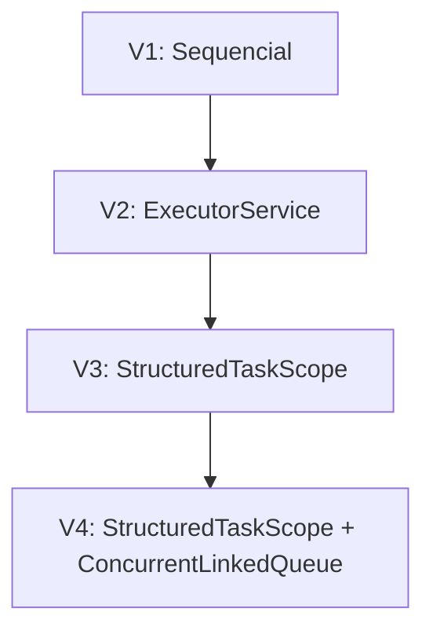

# Arquitetura do projeto

O projeto é uma aplicação Java simples, concentrada em `src/Main.java`, sem Maven, Gradle ou frameworks. As quatro versões resolvem o mesmo problema e continuam disponíveis no menu. A evolução permite comparar maneiras diferentes de organizar o processamento.

As setas representam a evolução do projeto. Uma execução escolhe somente uma versão; não passa pelas quatro.

## Base comum

`gerarMatriz()` preenche a matriz usando a posição de cada elemento, sem `Random`. `calcular()` executa 1000 iterações com `Math.sin`, `Math.cos` e `Math.sqrt`. Todas as versões usam esses mesmos métodos.

Nas versões V2, V3 e V4, a matriz é dividida em 5, 10 ou 100 blocos contíguos de linhas. Para a tarefa `t`, os limites são `t * linhas / tarefas` e `(t + 1) * linhas / tarefas`, usando divisão inteira. O limite final é exclusivo. Isso cobre todas as linhas, sem sobreposição, inclusive quando a divisão não é exata.

## V1 — Sequencial

`processar()` percorre cada linha e coluna na tarefa principal, calculando e acumulando um elemento por vez. É a referência para comparar os resultados e os tempos das outras versões.

## V2 — ExecutorService

`processarParalelo()` envia tarefas para um pool fixo. O número de threads é o menor entre a quantidade de tarefas e os processadores disponíveis. Cada tarefa retorna uma soma local. A tarefa principal obtém os valores por `Future.get()` e soma na ordem de envio. O método chama `shutdown()` em `finally` e solicita cancelamento das tarefas quando a execução não termina com sucesso.

## V3 — StructuredTaskScope

`processarEstruturado()` abre um escopo com `try-with-resources`, cria subtarefas por `fork()` e espera por `join()`. Após o sucesso, soma os valores de `Subtask.get()` na ordem de criação. O fechamento do escopo mantém o término das subtarefas dentro do ciclo de vida da tarefa principal.

## V4 — StructuredTaskScope + ConcurrentLinkedQueue

`processarEstadoCompartilhado()` mantém o escopo da V3, mas cria uma fila concorrente compartilhada por execução. Cada subtarefa calcula sua soma local e insere um parcial na fila. Depois de `join()` bem-sucedido, a tarefa principal soma os valores da fila. A ordem de inserção pode variar entre execuções.

## Medição

`executarProcessamento()` cria a matriz antes de iniciar `System.nanoTime()`. A medição abrange o método de processamento escolhido, incluindo o gerenciamento das tarefas quando houver, e termina antes da apresentação do resultado. O programa mostra o tempo em milissegundos e segundos.
